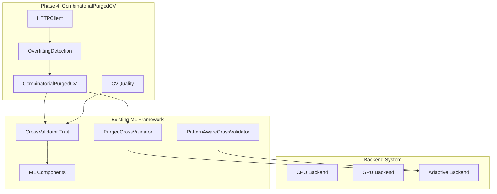

# Phase 4 Architecture: CombinatorialPurgedCV for Overfitting Detection

## Executive Summary

Phase 4 introduces **CombinatorialPurgedCV (CPCV)** - an advanced cross-validation methodology for detecting overfitting in financial machine learning models. This architecture extends the existing ML framework with minimal viable functionality while maintaining backward compatibility and following lean methodology principles.

### Core Value Proposition
- **Overfitting Detection**: Statistical methods to calculate Probability of Backtest Overfitting (PBO)
- **N-k Group Combinations**: Systematic evaluation of model performance across different data subsets
- **Enhanced Validation**: Improved cross-validation quality metrics and split validation
- **External Data Integration**: HTTP client for real-time data feeds and validation

## Architecture Overview

### System Context



### Component Architecture

The Phase 4 architecture consists of four primary components:

1. **CombinatorialPurgedCV**: Core CPCV implementation with N-k group combinations
2. **OverfittingDetection**: Statistical methods for PBO calculation and validation
3. **CVQuality**: Enhanced validation and split quality metrics
4. **HTTPClient**: Async client for external data feeds and validation

## Component Specifications

### 1. CombinatorialPurgedCV

**Purpose**: Implements combinatorial purged cross-validation for systematic overfitting detection.

**Key Features**:
- N-k group combinations for comprehensive model evaluation
- Integration with existing `CrossValidator` trait
- Backward compatibility with `PurgedCrossValidator`
- Thread-safe implementation (`Send + Sync + 'static`)

**Interface Design**:
```rust
pub struct CombinatorialPurgedCV {
    base_validator: PurgedCrossValidator,
    n_groups: usize,
    k_test_groups: usize,
    combination_strategy: CombinationStrategy,
    performance_cache: HashMap<String, f64>,
}

impl CombinatorialPurgedCV {
    pub fn new(
        embargo_pct: f32,
        n_groups: usize,
        k_test_groups: usize,
        min_train_size: usize,
        min_test_size: usize,
    ) -> Self;
    
    pub fn generate_combinations(&self) -> Vec<Vec<usize>>;
    pub fn evaluate_combination(&self, combination: &[usize]) -> PyResult<CVMetrics>;
    pub fn calculate_pbo(&self, results: &[CVMetrics]) -> f64;
}

impl CrossValidator for CombinatorialPurgedCV {
    // Extends existing trait with combinatorial functionality
}
```

**Algorithm**:
1. Divide data into N groups with purged boundaries
2. Generate all C(N,k) combinations of k test groups
3. For each combination, train on remaining N-k groups
4. Calculate performance metrics for each combination
5. Apply statistical tests for overfitting detection

### 2. OverfittingDetection

**Purpose**: Provides statistical methods for detecting and quantifying overfitting.

**Key Features**:
- Probability of Backtest Overfitting (PBO) calculation
- Statistical significance testing
- Performance degradation analysis
- Integration with external validation data

**Interface Design**:
```rust
pub struct OverfittingDetection {
    significance_level: f64,
    min_combinations: usize,
    http_client: Option<HTTPClient>,
}

impl OverfittingDetection {
    pub fn new(significance_level: f64, min_combinations: usize) -> Self;
    
    pub fn calculate_pbo(&self, in_sample: &[f64], out_sample: &[f64]) -> PyResult<PBOResult>;
    pub fn detect_overfitting(&self, cv_results: &[CVMetrics]) -> PyResult<OverfittingReport>;
    pub fn validate_with_external_data(&self, model_id: &str) -> PyResult<ValidationResult>;
}

#[derive(Debug, Clone)]
pub struct PBOResult {
    pub pbo_value: f64,
    pub confidence_interval: (f64, f64),
    pub is_overfit: bool,
    pub statistical_significance: f64,
}
```

**Statistical Methods**:
- **PBO Calculation**: `PBO = P[median(IS) ≤ median(OOS)]`
- **Confidence Intervals**: Bootstrap-based confidence estimation
- **Significance Testing**: Mann-Whitney U test for distribution comparison

### 3. CVQuality

**Purpose**: Enhanced cross-validation quality metrics and validation.

**Key Features**:
- Split quality assessment
- Temporal consistency validation
- Data leakage detection
- Performance metric standardization

**Interface Design**:
```rust
pub struct CVQuality {
    min_quality_score: f64,
    temporal_validation: bool,
    leakage_detection: bool,
}

impl CVQuality {
    pub fn new(min_quality_score: f64) -> Self;
    
    pub fn assess_split_quality(&self, splits: &[(Vec<usize>, Vec<usize>)]) -> PyResult<QualityReport>;
    pub fn validate_temporal_consistency(&self, splits: &[(Vec<usize>, Vec<usize>)]) -> bool;
    pub fn detect_data_leakage(&self, train_indices: &[usize], test_indices: &[usize]) -> bool;
    pub fn standardize_metrics(&self, metrics: &[CVMetrics]) -> Vec<StandardizedMetrics>;
}

#[derive(Debug, Clone)]
pub struct QualityReport {
    pub overall_score: f64,
    pub temporal_consistency: bool,
    pub leakage_detected: bool,
    pub split_balance: f64,
    pub embargo_compliance: bool,
}
```

### 4. HTTPClient

**Purpose**: Async HTTP client for external data integration and validation.

**Key Features**:
- Async/await support with tokio
- Configurable retry logic and timeouts
- JSON/CSV data format support
- Authentication and rate limiting

**Interface Design**:
```rust
pub struct HTTPClient {
    client: reqwest::Client,
    base_url: String,
    auth_token: Option<String>,
    retry_config: RetryConfig,
}

impl HTTPClient {
    pub fn new(base_url: String) -> Self;
    pub fn with_auth(mut self, token: String) -> Self;
    
    pub async fn fetch_validation_data(&self, endpoint: &str) -> Result<ValidationData, HTTPError>;
    pub async fn submit_model_results(&self, results: &ModelResults) -> Result<(), HTTPError>;
    pub async fn health_check(&self) -> Result<bool, HTTPError>;
}

#[derive(Debug, Clone)]
pub struct ValidationData {
    pub prices: Vec<f64>,
    pub features: Vec<Vec<f64>>,
    pub timestamps: Vec<i64>,
    pub metadata: HashMap<String, String>,
}
```

## File Structure Design

```
src/ml/components/
├── cross_validation.rs          # Existing - extend with CPCV
├── overfitting_detection.rs     # New - Statistical methods
├── cv_quality.rs                # New - Enhanced validation
├── http_client.rs               # New - External data integration
└── mod.rs                       # Updated exports

tests/
├── combinatorial_cv_tests.rs    # New - CPCV testing
├── overfitting_detection_tests.rs # New - Statistical validation
├── cv_quality_tests.rs          # New - Quality metrics testing
└── http_client_tests.rs         # New - HTTP integration testing

examples/
├── phase4_example.rs            # New - Complete workflow demo
└── cpcv_analysis.rs             # New - Overfitting analysis demo
```

## Integration Strategy

### Backward Compatibility

The Phase 4 architecture maintains full backward compatibility:

```rust
// Existing code continues to work unchanged
let validator = PurgedCrossValidator::new(0.01, 50, 10);
let splits = validator.create_purged_cv_splits(1000, 5, 0.01)?;

// New functionality extends existing patterns
let cpcv = CombinatorialPurgedCV::new(0.01, 10, 3, 50, 10);
let combinations = cpcv.generate_combinations();
let pbo_result = cpcv.calculate_pbo(&cv_results)?;
```

### Trait Integration

Phase 4 components integrate seamlessly with existing traits:

```rust
// CombinatorialPurgedCV implements CrossValidator
impl CrossValidator for CombinatorialPurgedCV {
    fn create_purged_cv_splits(&self, n_samples: usize, n_splits: usize, embargo_pct: f32) 
        -> PyResult<Vec<(Vec<usize>, Vec<usize>)>> {
        // Delegate to base validator for compatibility
        self.base_validator.create_purged_cv_splits(n_samples, n_splits, embargo_pct)
    }
    
    // New combinatorial methods
    fn create_combinatorial_splits(&self, n_samples: usize) 
        -> PyResult<Vec<CombinationSplit>> {
        // CPCV-specific implementation
    }
}
```

### Backend Integration

Phase 4 leverages the existing adaptive backend system:

```rust
// Automatic backend selection for computational tasks
impl CombinatorialPurgedCV {
    fn should_use_parallel(&self) -> bool {
        self.n_groups > 8 && self.k_test_groups > 2
    }
    
    fn calculate_combinations_parallel(&self) -> Vec<CVMetrics> {
        // Use rayon for CPU parallelization
        // Leverage GPU backend for large matrix operations
    }
}
```

## Implementation Phases

### Phase 4.1: Core CombinatorialPurgedCV (Week 1-2)

**Deliverables**:
- `CombinatorialPurgedCV` struct with basic N-k combinations
- Integration with existing `CrossValidator` trait
- Basic PBO calculation in `OverfittingDetection`
- Unit tests and documentation

**Success Criteria**:
- Generate valid combinatorial splits
- Calculate PBO with statistical significance
- Maintain backward compatibility
- Pass all existing tests

### Phase 4.2: Enhanced CV Quality (Week 3-4)

**Deliverables**:
- `CVQuality` component with split assessment
- Enhanced validation metrics
- Temporal consistency checks
- Data leakage detection

**Success Criteria**:
- Comprehensive quality scoring
- Automated leakage detection
- Performance benchmarking
- Integration tests

### Phase 4.3: HTTP Client Integration (Week 5-6)

**Deliverables**:
- `HTTPClient` with async support
- External data validation
- Authentication and retry logic
- End-to-end workflow examples

**Success Criteria**:
- Reliable external data fetching
- Robust error handling
- Complete workflow integration
- Performance optimization

## Technical Specifications

### Combinatorial Algorithm

**Mathematical Foundation**:
```
Given N groups and k test groups:
- Total combinations: C(N,k) = N! / (k!(N-k)!)
- For each combination i:
  - Train on groups: {1,2,...,N} \ {test_groups_i}
  - Test on groups: test_groups_i
  - Calculate performance: P_i
```

**Implementation Strategy**:
```rust
fn generate_combinations(&self) -> Vec<Vec<usize>> {
    let mut combinations = Vec::new();
    let groups: Vec<usize> = (0..self.n_groups).collect();
    
    // Use itertools for efficient combination generation
    for combo in groups.iter().combinations(self.k_test_groups) {
        combinations.push(combo.into_iter().cloned().collect());
    }
    
    combinations
}
```

### PBO Calculation

**Statistical Method**:
```rust
fn calculate_pbo(&self, in_sample: &[f64], out_sample: &[f64]) -> f64 {
    let n = in_sample.len();
    let mut count = 0;
    
    // Bootstrap sampling for robust estimation
    for _ in 0..10000 {
        let is_sample = bootstrap_sample(in_sample);
        let oos_sample = bootstrap_sample(out_sample);
        
        if median(&is_sample) <= median(&oos_sample) {
            count += 1;
        }
    }
    
    count as f64 / 10000.0
}
```

### Performance Optimization

**Parallel Processing**:
- Use `rayon` for CPU parallelization of combinations
- Leverage adaptive backend for optimal resource utilization
- Cache intermediate results to avoid recomputation

**Memory Management**:
- Streaming processing for large datasets
- Efficient data structures for combination storage
- Memory-mapped files for external data

## Error Handling Strategy

### Error Types

```rust
#[derive(Debug, thiserror::Error)]
pub enum Phase4Error {
    #[error("Invalid combination parameters: N={n}, k={k}")]
    InvalidCombination { n: usize, k: usize },
    
    #[error("Insufficient data for PBO calculation: need at least {min}, got {actual}")]
    InsufficientData { min: usize, actual: usize },
    
    #[error("HTTP client error: {source}")]
    HttpError { source: reqwest::Error },
    
    #[error("Statistical calculation failed: {reason}")]
    StatisticalError { reason: String },
}
```

### Error Recovery

- Graceful degradation when external data unavailable
- Fallback to simpler methods when combinations too large
- Comprehensive logging for debugging and monitoring

## Testing Strategy

### Unit Testing

**Coverage Requirements**:
- 95% code coverage for all new components
- Property-based testing for statistical methods
- Edge case validation for extreme parameters

**Test Categories**:
```rust
#[cfg(test)]
mod tests {
    // Correctness tests
    #[test] fn test_combination_generation_correctness() { }
    #[test] fn test_pbo_calculation_accuracy() { }
    
    // Performance tests
    #[test] fn test_large_dataset_performance() { }
    #[test] fn test_parallel_processing_speedup() { }
    
    // Integration tests
    #[test] fn test_backward_compatibility() { }
    #[test] fn test_trait_integration() { }
    
    // Edge cases
    #[test] fn test_minimal_data_handling() { }
    #[test] fn test_extreme_parameters() { }
}
```

### Integration Testing

**Workflow Testing**:
- End-to-end CPCV workflow validation
- External data integration testing
- Performance regression testing
- Cross-platform compatibility

### Validation Testing

**Statistical Validation**:
- Monte Carlo simulation for PBO accuracy
- Comparison with reference implementations
- Sensitivity analysis for parameter variations

## Performance Considerations

### Computational Complexity

**Time Complexity**:
- Combination generation: O(C(N,k))
- PBO calculation: O(n log n) per combination
- Overall: O(C(N,k) × n log n)

**Space Complexity**:
- Combination storage: O(C(N,k) × k)
- Intermediate results: O(n × C(N,k))
- Optimized with streaming: O(n)

### Optimization Strategies

**Algorithmic Optimizations**:
- Early termination for obvious overfitting cases
- Incremental PBO calculation
- Cached intermediate computations

**System Optimizations**:
- SIMD instructions for statistical calculations
- Memory pool allocation for frequent operations
- Async I/O for external data fetching

## Security Considerations

### Data Protection

- Secure HTTP connections (TLS 1.3)
- API key management and rotation
- Data sanitization for external inputs
- Audit logging for sensitive operations

### Access Control

- Role-based access for external data sources
- Rate limiting for API calls
- Input validation and sanitization
- Secure error message handling

## Monitoring and Observability

### Metrics Collection

```rust
pub struct Phase4Metrics {
    pub combinations_processed: u64,
    pub pbo_calculations: u64,
    pub http_requests: u64,
    pub processing_time_ms: u64,
    pub error_count: u64,
}
```

### Logging Strategy

- Structured logging with `tracing` crate
- Performance metrics collection
- Error tracking and alerting
- Debug information for troubleshooting

## Migration Path

### Existing Code Migration

**No Breaking Changes**:
- All existing `CrossValidator` implementations continue working
- New functionality is additive only
- Deprecation warnings for outdated patterns

**Gradual Adoption**:
```rust
// Phase 1: Drop-in replacement
let validator = CombinatorialPurgedCV::from_existing(old_validator);

// Phase 2: Enhanced features
validator.enable_overfitting_detection();

// Phase 3: Full integration
validator.with_external_validation(http_client);
```

## Documentation Strategy

### API Documentation

- Comprehensive rustdoc comments
- Code examples for all public methods
- Mathematical formulations and references
- Performance characteristics documentation

### User Guides

- Getting started tutorial
- Advanced usage patterns
- Troubleshooting guide
- Best practices documentation

### Reference Materials

- Statistical methodology explanation
- Algorithm implementation details
- Performance benchmarking results
- Comparison with existing methods

## Conclusion

The Phase 4 architecture provides a robust, scalable foundation for advanced cross-validation and overfitting detection in financial machine learning. By following lean methodology principles and maintaining backward compatibility, this design enables immediate value delivery while supporting future enhancements.

### Key Benefits

1. **Immediate Value**: Core CPCV functionality available in Phase 4.1
2. **Scalable Design**: Architecture supports future statistical methods
3. **Backward Compatible**: Existing code continues working unchanged
4. **Performance Optimized**: Leverages existing backend infrastructure
5. **Well Tested**: Comprehensive testing strategy ensures reliability

### Next Steps

1. Begin Phase 4.1 implementation with core CPCV functionality
2. Establish CI/CD pipeline for continuous validation
3. Create initial documentation and examples
4. Gather user feedback for Phase 4.2 planning
5. Plan integration with existing ML workflows

This architecture document serves as the blueprint for implementing Phase 4, ensuring consistent development practices and successful delivery of advanced cross-validation capabilities.